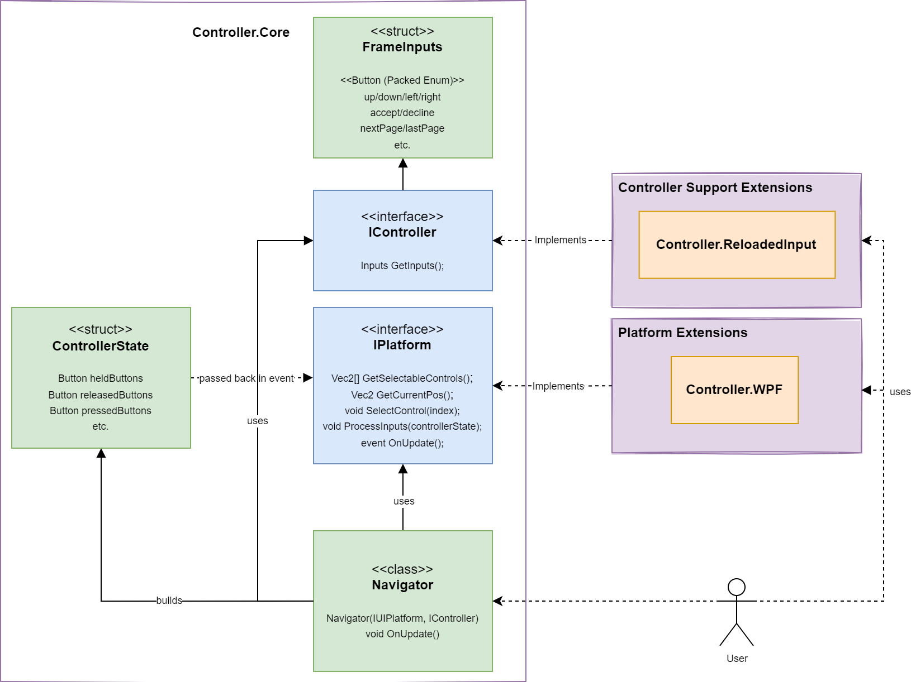

<div align="center">
	<h1>Sewer56.UI.Controller</h1>
	
	<br/> <br/>
	<strong><i>A basic library for UI Controller Navigation.</i></strong><br/>
    <i>Made for Reloaded II, opened to all.</i>
	<br/> <br/>
	<!-- NuGet -->
	<a href="https://www.nuget.org/packages/Sewer56.UI.Controller">
		
	</a>
</div>

# Sewer56.UI.Controller

Sewer56.UI.Controller is a simple personal use library for navigating user interfaces via controllers (and/or other supported input devices). It is a modular library, allowing you to add your own custom backends for input and/or UI Platform. 

## Usage

Basic usage of the library is as follows:  

**Instantiation**

```csharp
// Create an IController, IPlatform and finally the Navigator
IController controller = new ReloadedInputController("Controller.json");
IPlatform   platform   = new WpfPlatform();
var navigator  = new Navigator(Platform, Controller);

// Callback for handling custom controls/input (if necessary)
platform.ProcessCustomInputs += ProcessCustomInputs;
```

That's all you need to do, just keep the Navigator around so it doesn't get garbage collected.  

**Modules**

Sewer56.UI.Controller consists of 3 modules:  
- Core: The core library, contained in `Sewer56.UI.Controller.Core`.  
- IPlatform: Abstracts a UI platform like WPF or WinForms. (e.g. `Sewer56.UI.Controller.WPF`).  
- IController: Provides input support to the library. (e.g. `Sewer56.UI.Controller.ReloadedInput`)

## Available Packages

- [Sewer56.UI.Controller.WPF](https://www.nuget.org/packages/Sewer56.UI.Controller.WPF): Adds basic WPF support to the library.  
- [Sewer56.UI.Controller.ReloadedInput](https://www.nuget.org/packages/Sewer56.UI.Controller.WPF): Adds `Reloaded.Input` support to the library.  
- [Sewer56.UI.Controller.ReloadedInput.Configurator](https://www.nuget.org/packages/Sewer56.UI.Controller.ReloadedInput.Configurator): Adds the `Reloaded.Input` Configurator to this library.  

## Structure of Sewer56.UI.Controller

If you are interested in contributing to the library, the following diagram represents the internal structure of the library (at the time of writing):  



Hopefully this can be useful 🤞.